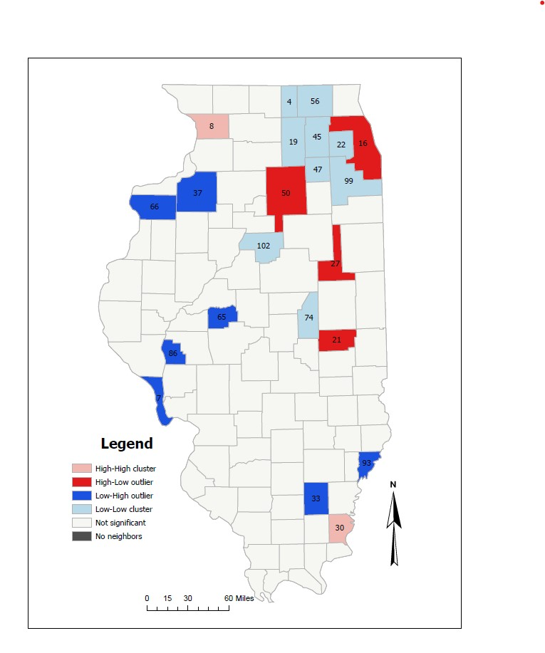
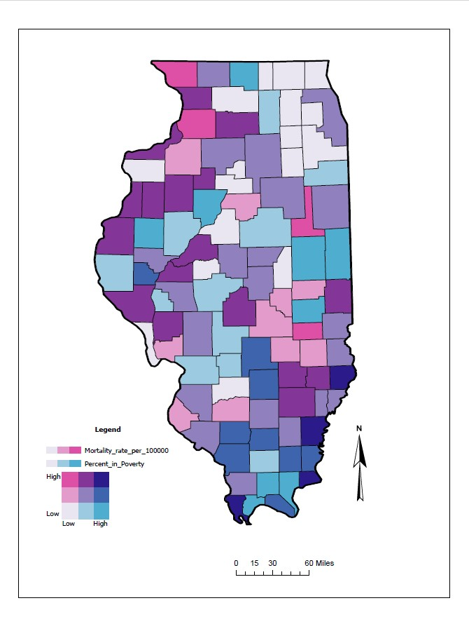
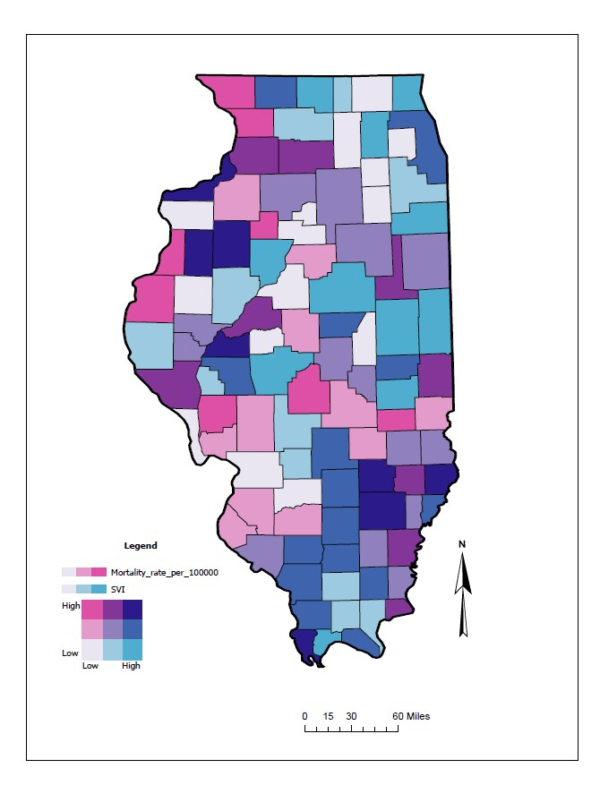

# Spatial Analysis of COVID-19 Mortality in Illinois (2020)

## Overview
This project analyzes spatial patterns of COVID-19 mortality across Illinois counties using GIS and spatial statistics in ArcGIS Pro.

The study focuses on spatial clustering, bivariate relationships with poverty and social vulnerability, and regression analysis.

---

## Study Area
Illinois, United States (County Level)

---

## Data Sources
- Illinois Department of Public Health (COVID-19 mortality data)
- U.S. Census Bureau (Population, Poverty)
- Social Vulnerability Index (SVI)
- County and State Shapefiles

---

## Tools & Technologies
- ArcGIS Pro
- Spatial Statistics Tools
- Geodatabase Management

---

## Methodology

### Data Preparation
- Extracted COVID-19 mortality data from PDF and converted to CSV
- Calculated mortality rate per 100,000 population
- Joined data to county shapefile

### Spatial Analysis
- Global Moran’s I using multiple spatial relationships:
  - Inverse Distance
  - Inverse Distance Squared
  - Contiguity (Edges)
  - Contiguity (Edges & Corners)

- Local Moran’s I (LISA):
  - High-High
  - Low-Low
  - High-Low
  - Low-High

### Bivariate Mapping
- Combined mortality with:
  - Poverty
  - Social Vulnerability Index (SVI)
- Created 3×3 classification maps

### Statistical Analysis
- Linear regression:
  - Mortality vs Poverty
  - Mortality vs SVI

---

## Workflow
Data Extraction → Data Cleaning → Rate Calculation → Spatial Analysis → Bivariate Mapping → Regression

---

## Results

### Spatial Patterns
- Northern Illinois shows strong clustering
- Majority of counties fall into Low-Low clusters
- Several significant spatial outliers identified

### Bivariate Findings
- Stronger relationship: Mortality vs Poverty
- Weaker relationship: Mortality vs SVI

### Regression Results
- Poverty:
  - R² = 0.0622
  - Significant relationship

- SVI:
  - R² = 0.0131
  - Weak relationship

---

## Key Findings
- COVID-19 mortality is spatially clustered
- Poverty has a measurable influence on mortality
- SVI shows limited statistical impact
- Bivariate mapping effectively reveals spatial relationships

---

## Outputs
- LISA Cluster Map
- Bivariate Map (Mortality vs Poverty)
- Bivariate Map (Mortality vs SVI)

---

## Skills Demonstrated
- Spatial Statistics (Moran’s I, LISA)
- Bivariate Mapping
- ArcGIS Pro Analysis
- Regression Analysis
- Public Health GIS

---

## Map Samples

## Author
Kalusha Aguti  
M.S. Geography (GIS & Data Analytics Applications)  
Southern Illinois University Edwardsville
